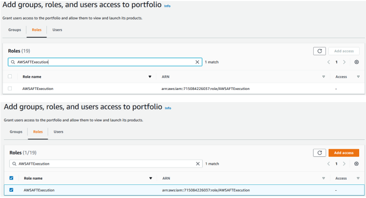
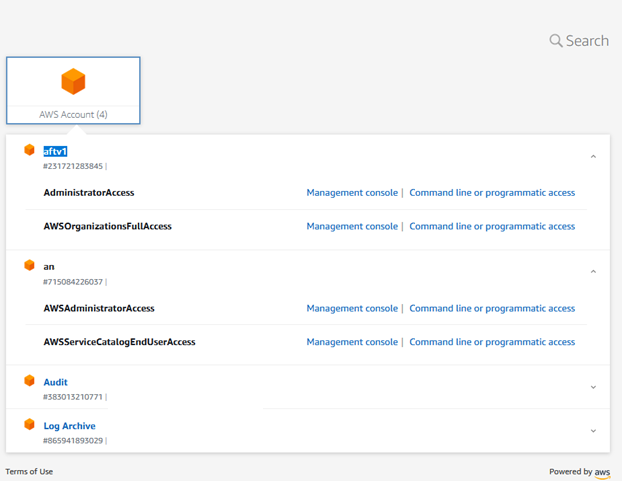

# xerris-terraform-control-tower-aft 

## Introduction

 The main objective of this repo is to provide an easy and fast Provisioning for  AWS Control tower Accounts via Terraform IAC automated pipeline. Before deploying this solution, You need to have an AWS Control Tower landing zone deployed in their account.

 ## Blueprint


# Pre-requisites

* AWS IAM user(non-root user) credentials with Administrator Access.
* AWS Control Tower, with the default Log and Audit accounts created. (Follow https://github.com/xerris/xerris-control-tower.git if not done already)
* Terraform v0.15+ installed locally .
* AWS account.
* AWS CLI.
* Github account.

# How to

## Account and Repo setup
The solutions needs new OU and new AWS account
* Add a new  OU in AWS Control Tower under your Root OU .
* Enroll a new  AWS account for the new OU, The pipelines  for AWS Account creation will be created in this account.


* Clone repo xerris-terraform-control-tower-aft 
    ```
    git clone https://github.com/xerris/xerris-terraform-control-tower-aft 

    ```

* Then, You will need  to fork  to you github account below   4 repos .
   ```
    https://github.com/hashicorp/learn-terraform-aft-account-request
    https://github.com/hashicorp/learn-terraform-aft-global-customizations
    https://github.com/hashicorp/learn-terraform-aft-account-customizations
    https://github.com/hashicorp/learn-terraform-aft-account-provisioning-customizations

   ```
* Once you have the 4 repos in your own Github account  you will need to  clone the repos from your account to your local.
   ```
    https://github.com/hashicorp/learn-terraform-aft-account-request
    https://github.com/hashicorp/learn-terraform-aft-global-customizations
    https://github.com/hashicorp/learn-terraform-aft-account-customizations
    https://github.com/hashicorp/learn-terraform-aft-account-provisioning-customizations


   ```
* Final Directory Structure 
    ```
    ├── learn-terraform-aft-account-customizations
    ├── learn-terraform-aft-account-provisioning-customizations
    ├── learn-terraform-aft-account-request
    ├── learn-terraform-aft-global-customizations
    └── xerris-terraform-control-tower-aft
    ```

# Deployment Steps
   
   Set and Validate your AWS non-root user credentials(From your Control tower Master Account)
   ```
   export AWS_ACCESS_KEY_ID=xxxxxxxxxxxx
   export AWS_SECRET_ACCESS_KEY=xxxxxxxxxxxx
   export AWS_DEFAULT_REGION="us-east-1"
   aws sts get-caller-identity
   ```
   Enter to folder xerris-terraform-control-tower-aft, main.tf is the file Where the module configuration lives. 
   * main.tf
    
    module "aft" {
    source                      = "github.com/aws-ia/terraform-aws-control_tower_account_factory"
    
    ct_management_account_id    = var.ct_management_account_id
    log_archive_account_id      = var.log_archive_account_id
    audit_account_id            = var.audit_account_id
    aft_management_account_id   = var.aft_management_account_id
    ct_home_region              = var.ct_home_region
    tf_backend_secondary_region = var.tf_backend_secondary_region

    vcs_provider                                  = "github"
    account_request_repo_name                     = "${var.github_username}/learn-terraform-aft-account-request"
    account_provisioning_customizations_repo_name = "${var.github_username}/learn-terraform-aft-account-provisioning-customizations"
    global_customizations_repo_name               = "${var.github_username}/learn-terraform-aft-global-customizations"
    account_customizations_repo_name              = "${var.github_username}/learn-terraform-aft-account-customizations"
    } 

   
   *  For module configuration We need to edit the terraform.tfvars (Below variables description)
   *  ct_management_account_id - Account id of AWS Control Tower Master account.
   *  log_archive_account_id -  Account id of log_archive.
   *  audit_account_id -  Account id of account.
   *  aft_management_account_id -  Account id of  the new AWS account .
   *  ct_home_region - Current Control Tower region .
   *  tf_backend_secondary_region - Secondary region where solution replicates the data.
   *  github_username - Your github username which was used to fork the repositories.

 ```
        ct_management_account_id    = "xxxxxxxxxxxx"
        log_archive_account_id      = "xxxxxxxxxxxx"
        audit_account_id            = "xxxxxxxxxxxx"
        aft_management_account_id   = "xxxxxxxxxxxx"
        ct_home_region              = "us-east-1"
        tf_backend_secondary_region = "us-west-2"
        github_username             = "xxxxxxxxxxxx"
      
```
## Terraform    Steps
```
$ terraform init
Initializing modules...

Initializing the backend...

Initializing provider plugins...
- Reusing previous version of hashicorp/local from the dependency lock file
- Reusing previous version of hashicorp/archive from the dependency lock file
- Reusing previous version of hashicorp/random from the dependency lock file
- Reusing previous version of hashicorp/time from the dependency lock file
....
Terraform has been successfully initialized!

```
The terraform apply setup takes around 30  minutes, In that time  a collection of AWS services will be created to help you manage AWS Control Tower accounts through Terraform configuration.
```
$ terraform apply

Terraform used the selected providers to generate the following execution plan. Resource actions are indicated with the following symbols:
  + create

Terraform will perform the following actions:
##...
Plan: 306 to add, 0 to change, 0 to destroy.

Do you want to perform these actions?
  Terraform will perform the actions described above.
  Only 'yes' will be accepted to approve.

  Enter a value: yes
##...
Apply complete! Resources: 306 added, 0 changed, 0 destroyed.
```
## The terraform apply will regenerate next resouces 


 

# One-time Version Control System configuration
 The Account creation action is triggered by the VCS and executed by CodePipeline for that reason We need to enable CodeStar connection to watch for changes to your Github account.

 * The Connection status is pending\

* Click Update pending connections\

* Choose for your VCS GitHub and authenticate.\


* Click Install a new app\

* Install AWS Connector For Github, you need to select the forked repos\

* A GitHub app id will be generated , then click on connect.\

* The status of the connection will change to available.\

* Now we need to add permissions in AWS service catalog.\

* Click on AWS Control Tower Account Factory\

* Select the Groups, roles, and users tab(third)
\
*  then click Add groups, roles, users.\

* Go to roles tab\

* then search for AWSAFTExecution. \

* Check the box next to it, and click Add access.,Now You will see the role.\


* Now lets move to Codepipeline.We will see 2 failed Pipelines, lets  Rerun account provisioning pipeline . 

* When you first deploy AFT, it attempts to run the account provisioning customizations pipeline but fails since you had not yet enabled the CodeStar connection. AWS automatically runs the pipeline on creation. You must now rerun the pipeline to create its downstream resources for when you are ready to provision an account using AFT.\

* The Pipeline is in progress\

* You can enter to the pipeline to see the flow, We will see the terraform apply stage.\

* This time the pipeline was successful\


# Deploy an account with AFT
Once you have deployed AFT and granted Github and Service Catalog access, you can use the pipeline to provision a new account in Control Tower.

Navigate to your cloned learn-terraform-aft-account-request repository.
```
cd ../learn-terraform-aft-account-request 
cd terraform 
```
* Now lets edit the main.tf and Lets create some accounts.

* main.tf

```
module "sandbox" {
  source = "./modules/aft-account-request"

  control_tower_parameters = {
    AccountEmail              = "AccountEmail@user.com"
    AccountName               = "sandbox-aft-xerris"
    ManagedOrganizationalUnit = "AFT"
    SSOUserEmail              = "AccountEmail@user.com"
    SSOUserFirstName          = "Sandbox"
    SSOUserLastName           = "AFT"
  }

  account_tags = {
    "Learn Tutorial" = "AFT"
  }

  change_management_parameters = {
    change_requested_by = "HashiCorp Learn"
    change_reason       = "Learn AWS Control Tower Account Factory for Terraform"
  }

  custom_fields = {
    group = "non-prod"
  }

  account_customizations_name = "sandbox"
}
```
*  We need to add the info related with the new account We want to the deploy.
* Code Pipeline will  perform the deployment of the new account.
* Just Do a commit and push.\

* Pipeline previos state.\

* Pipeline running and Finished.\

*  AWS landing Zone Before account creation.\

* AWS landing Zone After account creation, We can se the new AWS account added to  our AWs landing zone.\

